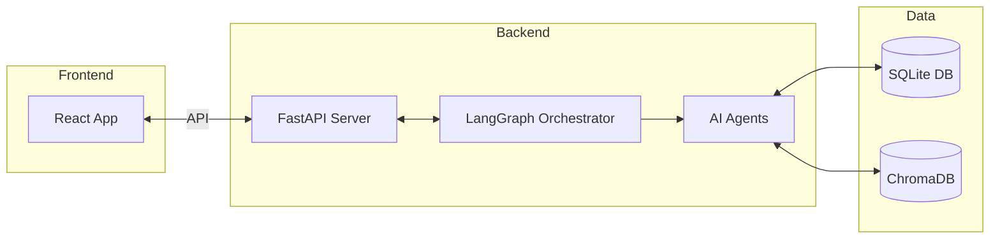
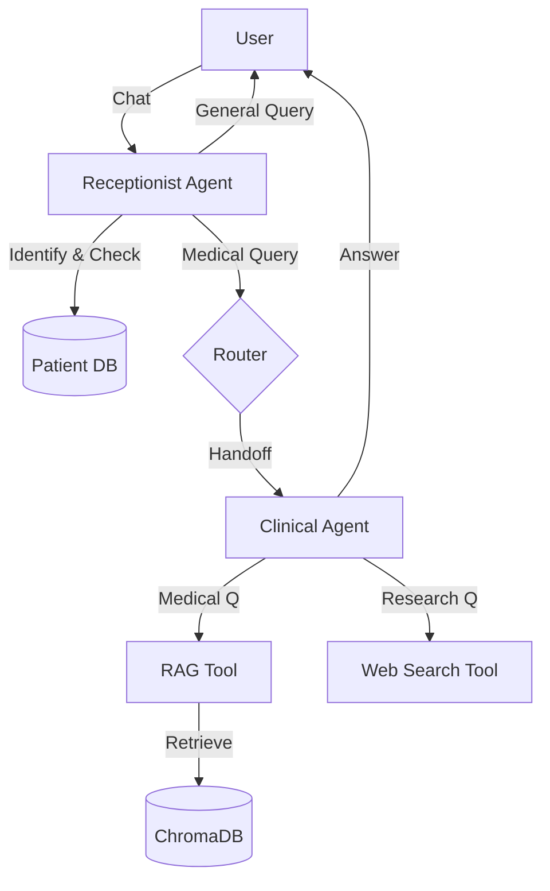

# Post Discharge Medical AI Assistant hii

## 🏥 What is this?
Imagine leaving the hospital after a surgery or treatment. You're home, but you have questions. *"Can I eat this?"*, *"Is this pain normal?"*, *"When is my next appointment?"*.

Usually, you'd have to call the hospital and wait on hold. This project solves that. It is an **Intelligent Medical Assistant** that knows who you are, what medication you take, and your medical history. It answers your questions instantly, accurately, and safely.

---

## 🤖 Meet Your AI Care Team
This isn't just a standard chatbot. It is a **Multi-Agent System**, meaning it runs like a real hospital team with specialized employees working together.

### 1. The Receptionist 👩‍💼
*   **Role**: The friendly front-desk staff.
*   **Job**: She greets you, checks your ID, and looks up your file in the database. She handles general chat and administrative tasks.
*   **Smart Handoff**: If you ask a medical question (e.g., *"My leg hurts"*), she knows she isn't a doctor. She politely says, *"Let me connect you to the Clinical Specialist,"* and transfers the conversation.

### 2. The Clinical Specialist 👨‍⚕️
*   **Role**: The medical expert.
*   **Job**: He answers your health-related questions.
*   **Superpower (RAG)**: He doesn't just guess. He has access to a trusted "digital library" of medical guidelines (Nephrology Reference). When you ask a question, he looks up the *exact* page in the book to give you a verified answer.
*   **Personalized Care**: He reads your specific medical file. If you are on a specific medication like *Lisinopril*, he tailors his advice to *you*, not a generic person.

---

## ⚙️ Under the Hood: The Technology

For developers and tech enthusiasts, here is how we built this **Agentic RAG System**:

### 🏗️ System Architecture
This diagram shows how the different parts of the application talk to each other.



### 🔄 The Agent Workflow
This shows the "brain" of the system. Notice how the **Router** decides who you talk to based on what you say.



### The Architecture: LangGraph 🧠
We use **LangGraph** to create a "State Machine" that controls the conversation flow. It's not just one prompt; it's a logic flow:
1.  **Start** → User talks to **Receptionist Agent**.
2.  **Router** → Analyzes the intent. Is it medical?
    *   **No** → Stay with Receptionist.
    *   **Yes** → Transfer state to **Clinical Agent**.
3.  **Action** → Clinical Agent calls tools (Search Database, Search Web) to get facts.

### The Brain: Retrieval-Augmented Generation (RAG) 📚
We use a technique called **RAG** to ensure medical accuracy without hallucinating facts.
1.  **Knowledge Base**: We have a file `nephrology_reference.txt` containing verified medical guidelines.
2.  **Vector Store**: We convert this text into mathematical vectors using **HuggingFace Embeddings** and store them in **ChromaDB** (a local vector database).
3.  **Retrieval**: When you ask a question, the system searches ChromaDB for the most relevant paragraphs and feeds them to the AI (Google Gemini) to construct the answer.

### The Tools 🛠️
The agents are equipped with specific tools to perform actions:
*   `patient_db_tool`: Connects to a **SQLite** database to fetch patient records.
*   `rag_tool`: Performs semantic search on the medical knowledge base.
*   `web_search_tool`: A simulated tool that mimics fetching the latest research (e.g., "2024 updates") to demonstrate how the agent handles external data.

---

## 🧪 Try It Yourself (Sample Data)

The system comes pre-loaded with "dummy" patients so you can test it right away.

### Patient 1: Abhishek B Shetty
*   **Condition**: Chronic Kidney Disease (Stage 2) with Diabetes.
*   **Scenario to Test**:
    *   *User*: "Hi, I'm Abhishek."
    *   *Bot*: "Welcome back..."
    *   *User*: "Can I eat a lot of sugar?"
    *   *Bot*: (Should check his file, see "Diabetes", and advise against it).

### Patient 2: John Smith
*   **Condition**: Chronic Kidney Disease (Stage 3).
*   **Scenario to Test**:
    *   *User*: "Hi, I'm John Smith."
    *   *User*: "I have swelling in my legs."
    *   *Bot*: (Should recognize "swelling" as a warning sign for Stage 3 and advise calling a doctor).

---

## 🚀 Installation Guide

### Prerequisites
*   **Node.js** (v18 or higher)
*   **Python** (v3.9 or higher)
*   **Google Gemini API Key** (Get one for free from Google AI Studio)

### Step 1: Backend Setup (The Brain)
1.  Navigate to the backend folder:
    ```bash
    cd backend
    ```
2.  Create a virtual environment (keeps your computer clean):
    ```bash
    python -m venv venv
    # Activate it:
    # Windows:
    venv\Scripts\activate
    # Mac/Linux:
    source venv/bin/activate
    ```
3.  Install the required Python libraries:
    ```bash
    pip install -r requirements.txt
    ```
4.  Set up your API Key:
    Create a file named `.env` inside the `backend` folder and add this line:
    ```env
    GOOGLE_API_KEY=your_actual_api_key_here
    ```
5.  Prepare the Database:
    Run these two scripts to create the fake patients and read the medical text:
    ```bash
    python scripts/seed_patients.py
    python app/rag/ingest.py
    ```
6.  Start the Server:
    ```bash
    uvicorn app.main:app --reload
    ```

### Step 2: Frontend Setup (The Interface)
1.  Open a new terminal and go to the frontend folder:
    ```bash
    cd frontend
    ```
2.  Install the interface libraries:
    ```bash
    npm install
    ```
3.  Start the website:
    ```bash
    npm run dev
    ```
4.  Open your browser and go to: `http://localhost:5173`

---

## 📄 License
This project is open-source under the **MIT License**.